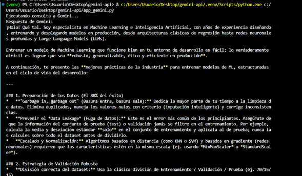

# Gemini API - Conexión básica

## Requisitos
- Python 3.x
- Una API key de Google AI Studio

## Instalación
1. Clona el repositorio
2. Instala las dependencias:
   pip install google-genai python-dotenv
3. Crea un archivo `.env` con tu API key:
   GEMINI_API_KEY=tu_key_aqui

## Ejecución
python app_gemini.py

## Evidencia

